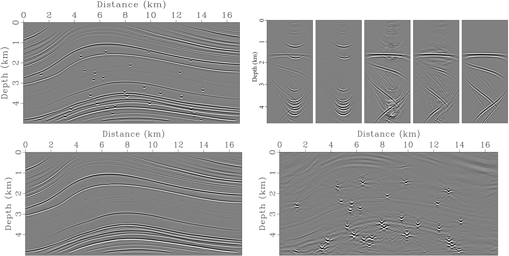

# Reflection-and-diffraction-separation-in-the-dip-angle-common-image-gathers-using-CNN

The reflection and diffraction have different geometric characteristics in DACIG, which provides one opportunity to separate diffractions and reflections. In this study, we present an efficient and accurate diffraction separation and imaging method using a convolutional neural network (CNN). The training data set of DACIGs is generated using one pass of seismic modeling and migration for velocity models with and without artificial scatterers, respectively. Then, a simplified end-to-end CNN is trained to identify and extract reflections from the migrated DACIGs that contain reflections and diffractions. Next, two adaptive subtraction strategies are presented to compute the diffraction DACIGs and stacked images, respectively. 




## Link to related article

[click this link](https://library.seg.org/doi/abs/10.1190/geo2022-0157.1) for more details.


## Publications

When using this model, please cite the following references:

**GB/T 7714:**

```
Sun J, Yang J, Li Z, et al. Reflection and diffraction separation in the dip-angle common-image gathers using convolutional neural network[J]. Geophysics, 2023, 88(1): WA281-WA291.
```

**Bib Tex:**

```
@article{sun2023reflection,
  title={Reflection and diffraction separation in the dip-angle common-image gathers using convolutional neural network},
  author={Sun, Jiaxing and Yang, Jidong and Li, Zhenchun and Huang, Jianping and Xu, Jie and Zhuang, Subin},
  journal={Geophysics},
  volume={88},
  number={1},
  pages={WA281--WA291},
  year={2023},
  publisher={Society of Exploration Geophysicists}
}

```
